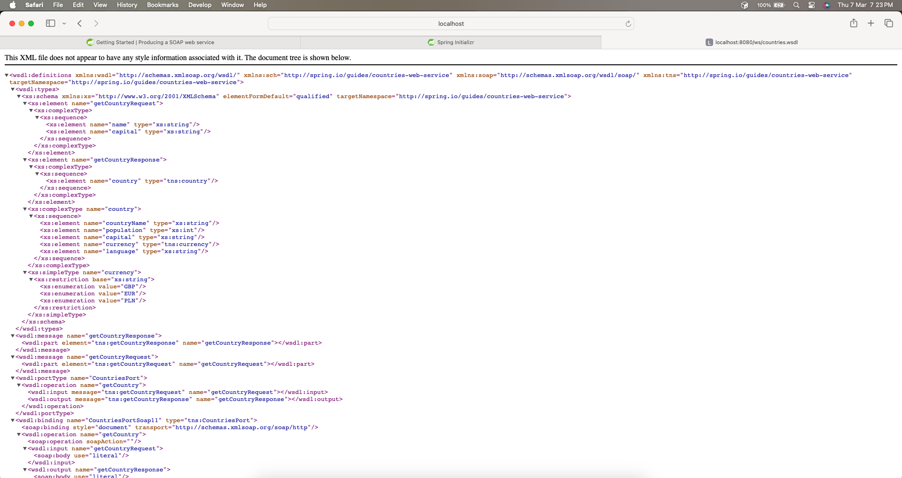

# Create Countries SOAP WebService - Producing One
## Prerequisites

* JDK: Java 17 or later
* Build Tool: Maven or Gradle
* IDE: IntelliJ or Eclipse

We can run this project either by start using Spring Initializr or download and unzip the source code or clone the repo

- [Download](https://github.com/bsmahi/countries-service/archive/main.zip) and unzip the source code repository and import the project into IDE
- Clone it using Git: `git clone https://github.com/bsmahi/countries-service.git`

## Start using Spring Initializr

You have the option to utilize this [pre-configured project](https://start.spring.io/#!type=maven-project&language=java&platformVersion=3.2.3&packaging=jar&jvmVersion=17&groupId=com.learnspring.webservice&artifactId=countries-service&name=countries-service&description=Demo%20project%20for%20Spring%20Boot&packageName=com.learnspring.webservice&dependencies=web,web-services) and simply click on Generate to obtain a ZIP file.
This project has been specifically set up to align with the examples provided in this tutorial.


To initiate the project manually,

1. go to the website https://start.spring.io. This platform will automatically fetch all the necessary dependencies for your application and handle most of the setup process on your behalf.
2. Select either `Gradle or Maven` as your build tool and specify the desired programming language. For the purpose of this guide, we will assume that you have chosen `Java`.
3. Proceed by clicking on the Dependencies tab and choose `Spring Web` and `Spring Web Services`.
4. Finally, click on the `Generate` button.
5. Once the process is complete, download the ZIP file that contains the configured web application based on your selections.
6. Import the project into IDE

## Add the Spring-WS dependency
The project needs to include `wsdl4j` as dependencies in your build file i.e, `pom.xml`

```xml
<dependency>
    <groupId>wsdl4j</groupId>
    <artifactId>wsdl4j</artifactId>
</dependency>
```

## Create XML Schema Design to define the Domain object
* Create `countries.xsd` under `src/main/resources` folder

```xml
<xs:schema xmlns:xs="http://www.w3.org/2001/XMLSchema"
           xmlns:tns="http://spring.io/guides/countries-web-service"
           targetNamespace="http://spring.io/guides/countries-web-service"
           elementFormDefault="qualified">
    <xs:element name="getCountryRequest">
        <xs:complexType>
            <xs:sequence>
                <xs:element name="name" type="xs:string"/>
            </xs:sequence>
        </xs:complexType>
    </xs:element>

    <xs:element name="getCountryResponse">
        <xs:complexType>
            <xs:sequence>
                <xs:element name="country" type="tns:country"/>
            </xs:sequence>
        </xs:complexType>
    </xs:element>

    <xs:complexType name="country">
        <xs:sequence>
            <xs:element name="countryName" type="xs:string"/>
            <xs:element name="population" type="xs:int"/>
            <xs:element name="capital" type="xs:string"/>
            <xs:element name="currency" type="tns:currency"/>
            <xs:element name="language" type="xs:string"/>
        </xs:sequence>
    </xs:complexType>

    <xs:simpleType name="currency">
        <xs:restriction base="xs:string">
            <xs:enumeration value="GBP"/>
            <xs:enumeration value="EUR"/>
            <xs:enumeration value="PLN"/>
        </xs:restriction>
    </xs:simpleType>
</xs:schema>
```
## Generate Java Objects based on XSD using jaxb2 maven plugin 
Add the following plugin into `pom.xml` under the `build` section

```xml
<plugin>
    <groupId>org.codehaus.mojo</groupId>
    <artifactId>jaxb2-maven-plugin</artifactId>
    <version>3.1.0</version>
    <executions>
        <execution>
            <id>xjc</id>
            <goals>
                <goal>xjc</goal>
            </goals>
        </execution>
    </executions>
    <configuration>
        <sources>
            <source>${project.basedir}/src/main/resources/countries.xsd</source>
        </sources>
    </configuration>
</plugin>
```
By default, generated classes are placed in the `target/generated-sources/jaxb/` directory.
However, if you want to the please add the following tag under `<configuration>` tag
```xml
<outputDirectory>${project.basedir}/src/main/java/com/learnspring/webservice/countries</outputDirectory>
```

## Execute the below command for generating the domain classes 
> mvn clean install

## Create Country Repository
To supply data to the web service, establish a country repository. This tutorial demonstrates how to create a mock country repository implementation with fixed data. 
Refer to the code snippet below (located at `src/main/java/com/learnspring/webservice/CountryRepository.java`) for detailed instructions.

```java
package com.learnspring.webservice;

import io.spring.guides.countries_web_service.Country;
import io.spring.guides.countries_web_service.Currency;
import jakarta.annotation.PostConstruct;
import org.springframework.stereotype.Component;
import org.springframework.util.Assert;

import java.util.HashMap;
import java.util.Map;

@Component
public class CountriesRepository {

    private static final Map<String, Country> countryDetails = new HashMap<>();

    @PostConstruct
    public void initData() {
        var countryOne = new Country();
        countryOne.setCountryName("Spain");
        countryOne.setCapital("Madrid");
        countryOne.setCurrency(Currency.EUR);
        countryOne.setPopulation(200000);
        countryOne.setLanguage("Spanish");

        countryDetails.put(countryOne.getCountryName(), countryOne);

        var countryTwo = new Country();
        countryTwo.setCountryName("Poland");
        countryTwo.setCapital("Warsaw");
        countryTwo.setCurrency(Currency.PLN);
        countryTwo.setPopulation(200001);
        countryTwo.setLanguage("polish");

        countryDetails.put(countryTwo.getCountryName(), countryTwo);

        var countryThree = new Country();
        countryThree.setCountryName("United Kingdom");
        countryThree.setCapital("London");
        countryThree.setCurrency(Currency.GBP);
        countryThree.setPopulation(200002);
        countryThree.setLanguage("English");

        countryDetails.put(countryThree.getCountryName(), countryThree);

    }

    public Country findCountry(String name) {
        Assert.notNull(name, "The country's name must not be null");
        return countryDetails.get(name);
    }
}

```
## Create Country Service Endpoint

In order to establish a service endpoint, all you require is a POJO with a handful of Spring WS annotations to manage the incoming SOAP requests.
The provided example (located at `src/main/java/com/learnspring/webservice/CountryEndpoint.java`) demonstrates such a class.

```java
package com.learnspring.webservice;

import io.spring.guides.countries_web_service.GetCountryRequest;
import io.spring.guides.countries_web_service.GetCountryResponse;
import org.springframework.ws.server.endpoint.annotation.Endpoint;
import org.springframework.ws.server.endpoint.annotation.PayloadRoot;
import org.springframework.ws.server.endpoint.annotation.RequestPayload;
import org.springframework.ws.server.endpoint.annotation.ResponsePayload;

@Endpoint // The annotation registers the class with Spring WS as a potential candidate for processing incoming SOAP messages
public class CountryEndpoint {
    private static final String NAMESPACE_URI = "http://spring.io/guides/countries-web-service";

    private final CountriesRepository countriesRepository;

    // Constructor Dependency Injection
    public CountryEndpoint(CountriesRepository countriesRepository) {
        this.countriesRepository = countriesRepository;
    }

    /**
     * <code>PayloadRoot</code> annotation is then used by Spring WS to pick the handler method, based on the message’s namespace and localPart.
     * <code>RequestPayload</code> annotation indicates that the incoming message will be mapped to the method’s request parameter
     * <code>ResponsePayload</code> annotation makes Spring WS map the returned value to the response payload
     * @param request payload for fetching the countries
     * @return countries details
     */
    @PayloadRoot(namespace = NAMESPACE_URI, localPart = "getCountryRequest")
    @ResponsePayload
    public GetCountryResponse getCountry(@RequestPayload GetCountryRequest request) {
        var response = new GetCountryResponse();
        response.setCountry(countriesRepository.findCountry(request.getName()));

        return response;
    }
}

```
## Configure Web Service Beans

Develop a fresh class containing Spring WS-related beans configuration, as illustrated in the subsequent listing found at `src/main/java/com/learnspring/webservice/WebServiceConfig.java`

```java
package com.learnspring.webservice;

import org.springframework.boot.web.servlet.ServletRegistrationBean;
import org.springframework.context.ApplicationContext;
import org.springframework.context.annotation.Bean;
import org.springframework.context.annotation.Configuration;
import org.springframework.core.io.ClassPathResource;
import org.springframework.ws.config.annotation.EnableWs;
import org.springframework.ws.config.annotation.WsConfigurerAdapter;
import org.springframework.ws.transport.http.MessageDispatcherServlet;
import org.springframework.ws.wsdl.wsdl11.DefaultWsdl11Definition;
import org.springframework.xml.xsd.SimpleXsdSchema;
import org.springframework.xml.xsd.XsdSchema;

@EnableWs //Enable Spring Web Services
@Configuration // Spring Configuration
public class WebServiceConfig extends WsConfigurerAdapter {

    // MessageDispatcherServlet
    // ApplicationContext
    // url -> /ws/*
    /**
     * Spring WS uses a different servlet type for handling SOAP messages: MessageDispatcherServlet. It is important to inject and set ApplicationContext to MessageDispatcherServlet.
     * Without that, Spring WS will not automatically detect Spring beans.
     * Naming this bean messageDispatcherServlet does not replace Spring Boot’s default DispatcherServlet bean.
     * @param applicationContext applicationContext
     * @return messageDispatcherServlet
     */
    @Bean
    public ServletRegistrationBean<MessageDispatcherServlet> messageDispatcherServlet(ApplicationContext applicationContext) {
        var servlet = new MessageDispatcherServlet();
        servlet.setApplicationContext(applicationContext);
        servlet.setTransformWsdlLocations(true);
        return new ServletRegistrationBean<>(servlet, "/ws/*");
    }

    // /ws/countries.wsdl
    // countries.xsd
    // DefaultWsdl11Definition exposes a standard WSDL 1.1 by using XsdSchema
    @Bean(name = "countries")
    public DefaultWsdl11Definition defaultWsdl11Definition(XsdSchema countriesSchema) {
        var wsdl11Definition = new DefaultWsdl11Definition();
        wsdl11Definition.setPortTypeName("CountriesPort");
        wsdl11Definition.setLocationUri("/ws");
        wsdl11Definition.setTargetNamespace("http://spring.io/guides/countries-web-service");
        wsdl11Definition.setSchema(countriesSchema);
        return wsdl11Definition;
    }

    @Bean
    public XsdSchema countriesSchema() {
        return new SimpleXsdSchema(new ClassPathResource("countries.xsd"));
    }
}
```
* You must provide bean names for the `MessageDispatcherServlet` and `DefaultWsdl11Definition`.
* These bean names will determine the URL at which the web service and the generated WSDL file can be accessed.
* In this scenario, the WSDL file will be accessible at `http://<host>:<port>/ws/countries.wsdl`

## Run the main class i.e., `CountriesServiceApplication` 

The servlet transformation for WSDL location is employed in this setup through `servlet.setTransformWsdlLocations(true)`.
Upon visiting http://localhost:8080/ws/countries.wsdl, the soap:address will show the accurate address. However, when accessing the WSDL via the public IP address linked to your device, you will see that address instead.



## Time to test the application

Once the application is up and running, it is now possible to conduct a test.
To proceed, kindly generate a file named `payload-request.xml` which will encompass the SOAP request outlined below:

```xml
<soapenv:Envelope xmlns:soapenv="http://schemas.xmlsoap.org/soap/envelope/"
				  xmlns:gs="http://spring.io/guides/countries-web-service">
   <soapenv:Header/>
   <soapenv:Body>
      <gs:getCountryRequest>
         <gs:name>Poland</gs:name>
      </gs:getCountryRequest>
   </soapenv:Body>
</soapenv:Envelope>
```
## Using inline xml data

```ccURL
curl <<-EOF -fsSL -H "content-type: text/xml" -d @- http://localhost:8080/ws \
  > target/response.xml && xmllint --format target/response.xml

<soapenv:Envelope xmlns:soapenv="http://schemas.xmlsoap.org/soap/envelope/"
                                  xmlns:gs="http://spring.io/guides/countries-web-service">
   <soapenv:Header/>
   <soapenv:Body>
      <gs:getCountryRequest>
         <gs:name>Poland</gs:name>
      </gs:getCountryRequest>
   </soapenv:Body>
</soapenv:Envelope>

EOF
```

We will get the following response

```xml
<?xml version="1.0"?>
<SOAP-ENV:Envelope xmlns:SOAP-ENV="http://schemas.xmlsoap.org/soap/envelope/">
  <SOAP-ENV:Header/>
  <SOAP-ENV:Body>
    <ns2:getCountryResponse xmlns:ns2="http://spring.io/guides/countries-web-service">
      <ns2:country>
        <ns2:countryName>Poland</ns2:countryName>
        <ns2:population>200001</ns2:population>
        <ns2:capital>Warsaw</ns2:capital>
        <ns2:currency>PLN</ns2:currency>
        <ns2:language>polish</ns2:language>
      </ns2:country>
    </ns2:getCountryResponse>
  </SOAP-ENV:Body>
</SOAP-ENV:Envelope>
```